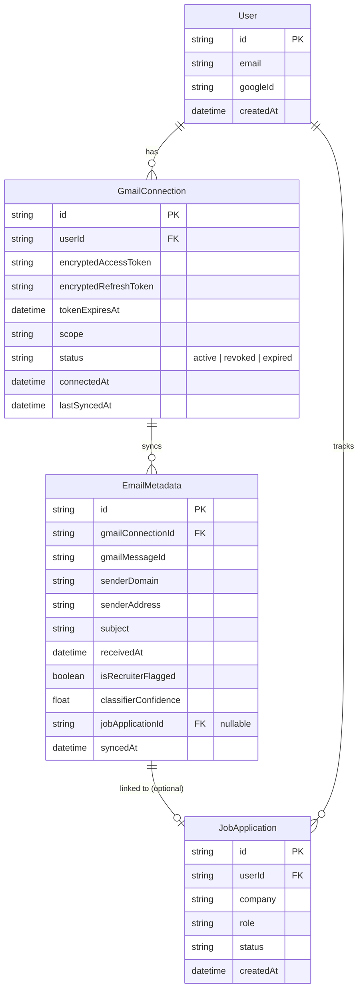

# RoleFlow — Gmail Auth Integration
## PRD + ERD

---

## 1. Problem / Goal

RoleFlow users manually track recruiter outreach and application status updates that actually live in their email. This feature connects a user's Gmail account so RoleFlow can automatically detect recruiter-related emails and surface them in the job tracker — without ever reading the actual content of the user's inbox.

**Core principle: privacy-first by design.** RoleFlow only ever requests `gmail.metadata` (headers, sender, subject, labels, thread info) for the core product. Full message body access (`gmail.readonly`) is scoped separately and deferred to the future browser extension component, where a user opts in explicitly for deeper parsing.

---

## 2. Scope

### In scope (this implementation)
- Google OAuth 2.0 consent flow, `gmail.metadata` scope only
- Secure token storage (encrypted at rest) tied to a RoleFlow user account
- Token refresh handling
- Metadata sync job (poll or push via Gmail API) pulling sender, subject, date, labels
- Basic rules-based recruiter classifier (sender domain + subject keyword matching)
- Revoke/disconnect flow
- Error states: expired/revoked token, rate limits, auth failures

### Explicitly out of scope (future work)
- `gmail.readonly` scope / full message body parsing — reserved for the browser extension
- LLM-based classification (Claude API fallback for ambiguous cases) — phase 2
- Multi-account support (one Google account per RoleFlow user for now)
- Real-time push notifications via Gmail Pub/Sub (polling is sufficient for v1)

---

## 3. User Flow

1. User clicks "Connect Gmail" in RoleFlow settings
2. Redirect to Google OAuth consent screen, scope: `https://www.googleapis.com/auth/gmail.metadata`
3. Google redirects back to RoleFlow's callback URL with an authorization code
4. Backend exchanges code for access token + refresh token
5. Tokens encrypted and stored, linked to the user's RoleFlow account
6. Background job periodically syncs metadata for new messages
7. Rules-based classifier flags likely recruiter emails
8. Flagged emails surface in RoleFlow's dashboard for user review/linking to a tracked job
9. User can disconnect at any time — this revokes the token with Google and deletes stored tokens

---

## 4. Data Model — ERD

### Table notes

- **GmailConnection.status** — tracks connection health so the UI can prompt re-auth if a refresh token is revoked or expires without user action.
- **EmailMetadata.classifierConfidence** — reserved now, populated later once the LLM fallback classifier (phase 2) is added; rules-based v1 can just set 1.0 / 0.0.
- **EmailMetadata.jobApplicationId** — nullable FK; a flagged email may not yet be linked to a tracked job until the user confirms it.
- Tokens are stored **encrypted at rest** (e.g., AES-256 via a KMS-managed key), never in plaintext, consistent with RoleFlow's JWE session cookie approach already in use elsewhere in the app.

---

## 5. Open Questions / Edge Cases

- What happens if a user revokes Gmail access directly from their Google Account settings (not through RoleFlow)? → Next sync attempt should catch the resulting 401/invalid_grant and flip `GmailConnection.status` to `revoked`, prompting re-auth in the UI.
- Rate limiting — Gmail API quotas; need backoff/retry strategy for the sync job.
- What's the sync cadence? Polling every N minutes vs. on-demand refresh triggered by user action — recommend starting with a scheduled poll (e.g., every 15-30 min) for v1 simplicity.
- Classifier false positives/negatives — v1 rules-based approach should log misses so the future LLM fallback has real examples to improve against.

---

## 6. Success Criteria (v1)

- User can connect and disconnect Gmail without errors
- Tokens refresh silently without requiring re-auth during normal use
- At least 80% of obviously recruiter-sourced emails (LinkedIn, Indeed, known ATS domains) get correctly flagged by the rules-based classifier
- Zero message body content ever stored or logged, verifiable by scope alone
